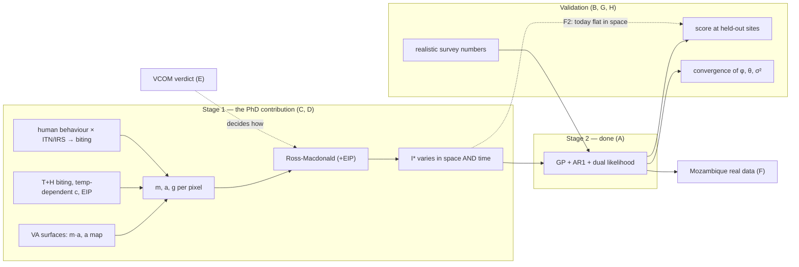

# Alignment graph: is the work on track with the supervisors' guidance?

Date: 2026-10-05 · Built by Opus 5.5 · Advisor: Fable
Yardstick: what the supervisors have asked for since the brainwave (N/D/G/P items
in `CHANGE_GRAPH.md` §1 and the subagent extraction). The proposal is secondary.
Evidence: the repo at `64a06b9`, `outputs/sim_estimation_results.RData`
(50 replicates, 11 Aug), `todo/`, and meetings up to Melbourne (Aug 2026).

## 1. What the supervisors are asking for (the asks)

| Thread | Ask | Most recent word |
|---|---|---|
| A. Design | Two-stage design, I* offset, GP, dual likelihood, compare with I* = 0 | brainwave, Mar 2026 |
| B. Show the benefit | The simulation study must *demonstrate* that vector information improves the map | brainwave |
| C. Stage 1 first | "Focus on the mechanistic part." Biting rate × human behaviour × interventions is the PhD contribution | Apr 2026 debrief |
| D. Real entomology | VA gives m·a, separated with a mapped a. Temperature-dependent c. EIP (Stopard/Churcher). T+H biting model | 1 Jun 2026 email |
| E. VCOM | Know VCOM and say in writing why you reuse it or don't | Apr + 1 Jun 2026 |
| F. Real data | Mozambique (2017+) in parallel with simulation | 30 Mar 2026 |
| G. Convergence | If the sampler hasn't converged, you can't judge the model | 30 Mar 2026 |
| H. Realism of the sim | Realistic survey numbers. VA inputs are model surfaces. Sensitivity at the 25th/75th percentiles | Melbourne, Aug 2026 |
| I. Presentation | Short decks. Clear notation. Know what every line means | Mar–Aug 2026 |

## 2. Where the work stands (with evidence)

| Thread | Status | Evidence |
|---|---|---|
| A | ✅ Done and faithful | `R/epiwave-foi-model.R`; equivalence-tested |
| B | ⚠️ **Not yet demonstrated** (see F1–F3) | RData: median map RMSE gain 2.4%, with I* better in 41/50 replicates |
| C | ❌ **Not started in this repo.** Stage 1 is still three constant/sinusoid stand-ins. `apply_interventions` uses crude multipliers with no human-behaviour component | `get_fixed_m/a/g`. `todo/04` and `todo/05` open since April. Hackathon T+H code (`hackthon2026/`) not ported |
| D | ❌ None in code: c is fixed at 0.8 (Nick's email says they "previously set it to 1"), there is no EIP in the ODE, and m and a are not separated | `ross_macdonald_ode` |
| E | ❌ Plan only, no verdict written | `todo/03` |
| F | ❌ No Mozambique code or data in the repo | `grep -ri mozambique R/` returns nothing |
| G | ❌ φ, θ and σ² have median R-hat 2.1–4.1. Since then the priors have been reparameterised, but this is untested at study scale | `study$recovery_summary`; Q2 |
| H | 🟡 Sensitivity script done. Survey coverage is still 30% of site-months (Dave: "crazy high") | `R/diagnostics/sensitivity_fixed_params.R`; `simulate_prevalence_surveys` |
| I | ✅ Code now readable and defensible (today's refactor) | commit `64a06b9` |

## 3. Findings nobody asked about

| F | Finding | Evidence | Why it matters |
|---|---|---|---|
| F1 | **The "money result" for α is an identity, not a finding.** In the I* = 0 model, α also absorbs mean(log I*). Its "bias" of −1.921 (sd across replicates 0.046) equals mean(log I*) = −1.924. I* is deterministic, so this is the same in every replicate. σ² is *inflated* for the same reason: without I*, the field must absorb log I* (variance 1.30), so it lands at 2.57 against a true 0.36. | `study$recovery_summary`; `simulate_epiwave_data` | The 6 July notes and slides present "α coverage 0% vs 80%" as evidence for the offset. Dave already questioned the "α coverage 80%" label in Melbourne. **What *is* legitimate:** without I*, α and ε cannot be read as baseline incidence and residual-from-mechanism. With I*, the ε map means "where the mechanism is wrong", which is the point of the GP. Keep that argument; drop the coverage comparison. |
| F2 | **In the simulation, I* does not vary in space.** Every site has the same seasonal m, the same a and g, and the same ITN ramp. The across-site sd of I* is **0** in every replicate. | `simulate_epiwave_data` (`byrow = TRUE` of one curve) | The thesis claim is that *vector data improve the spatial map*. With no spatial signal in I*, the study only tests seasonality, so a median RMSE gain of 2.4% (with I* better in 41/50 replicates) is about what you would expect. |
| F3 | **The map is scored only where data exist.** Every site has cases every month and is scored in-sample. Nick's "fits as well as a classic geostatistical model but defaults to the mechanistic model" is a statement about **where data are absent**, and mapping is prediction at unsampled pixels. | harness `.score_prediction` | Fix F3 *together with* F2. Held-out scoring alone still shows little, because the I* = 0 GP fills held-out sites with the shared seasonal pattern from their neighbours. |
| F4 | The paper reports results from earlier priors (Q2, already raised). | `prior_notes.md` | |
| F5 | **The order and depth of effort run against Nick's April advice. The simulation study itself does not.** The sim study *is* Objective 2, and Nick accepted it as simulation-only in April. But since 24 April there have been no Stage 1 commits, while the toy Stage 2 got a ridge reparameterisation and three rounds of deck polish. Meanwhile `todo/04` and `todo/05` sat untouched. | git log since 24 Apr | The T+H a-model is the one task Nick explicitly assigned (1 Jun), and nothing blocks it. |
| F6 | **Even the true model has not converged.** With I*, σ² has a mean of 0.72 (2× the truth, 52% coverage) and θ coverage is 8%. N10 applies to the "with" model too. | `study$recovery_summary` | Say so before Nick does. |
| F7 | **The survey numbers were misread in Melbourne.** Dave read "30%" as 30% of the population, and that was confirmed. In fact the sim has 147 of 490 site-months surveyed, with 50–200 tested out of 10,000 people (0.5–2%). The real unrealism is the *frequency*: 30% of site-months, against a malaria indicator survey roughly every 3 years. | `simulate_prevalence_surveys` | Send Dave the correction. |
| F8 | **There is no sparse-survey scenario.** Melbourne: "without survey data what do we do? Arguably more relevant", because USAID-funded surveys are gone. Nick named prevalence-only fitting as a fallback in April. | Melbourne transcript; Apr debrief | CLAUDE.md bans case-only fitting, not prevalence-only. |

## 4. The graph



Read it left to right: the missing nodes are all on the left. Stage 1 feeds
everything else. While I* is flat in space (F2), no amount of Stage 2 work can
show the benefit Nick's design is meant to show.

## 5. Recommendations

**R1 — Fix the study before running it again.** These changes are cheap and
use code that already exists.
- Give the simulated sites **different entomology** (baseline m, ITN coverage
  and resistance varying by site), so I* carries spatial signal (F2).
- Score the map at **held-out sites or site-months** (F3). In greta, pass all
  sites to `gp()` and attach the Poisson/Binomial only at observed ones; no
  projection code is needed. With 10 sites, holding sites out leaves about 7 to
  inform φ. Raise to about 30 sites (the sparse GP already exists), or hold out
  site-months, since reporting gaps are realistic anyway.
- Realistic survey frequency, e.g. one survey round every 3 years (F7). Add a
  **sparse-survey arm** (F8).
- Stop presenting α/σ² coverage across the two models as evidence (F1). The
  headline is the held-out map; the ε-interpretation argument goes in the
  discussion.

**R2 — Make convergence a gate**, for *both* models (F6). Run one replicate at
the new priors with 4 × 2000 samples. If φ, θ and σ² still have R-hat > 1.1,
take it to Nick before running the 50-replicate study again (G, N10).

**R3 — Move the effort to Stage 1** (C, D), which is Nick's stated priority:
1. **Start here:** this is the task Nick assigned on 1 June, and nothing blocks
   it. Port the hackathon T+H modules into `get_fixed_a` and `get_fixed_g`, then m,
   behind the same `[n_sites x n_times]` interface. Nothing downstream changes.
2. Add the EIP to the ODE (a standard Ross-Macdonald with an EIP, or
   p^n survival) and temperature-dependent c.
3. Biting rate × human behaviour × interventions: write the model as equations
   first (a one-page note for Nick), then code it.

**R4 — Write the VCOM verdict** (one page: what it is, what overlaps, why
reuse/extend/own). Nick expects it, and it decides how R3.2 is built.

**R5 — Start the Mozambique pipeline in a side script** (C3), loading data
into the same matrix shapes. The point is to find model flaws early (N24).

**What not to do:** more Stage 2 tuning, BCB/NNGP scaling, or polishing the
*numbers* from the current sim before R1–R3. Writing the paper's structure
continues; Gerry advised paper-first and Nick agreed.

## 6. Questions for Nick (one line each)

1. Prevalence link: keep `1 − exp(−Σ I·q)` (bounded), or use your linear Σ I·q?
2. γ units: add the ×days-per-month factor so γ is a pure reporting proportion?
3. Is held-out-site map accuracy the right headline metric for the
   with/without-I* comparison?
4. For EIP and temperature-dependent c, should I build my own, or take them
   from VCOM / Stopard–Churcher code?
5. If surveys become rare, is your prevalence-only fallback the next arm to
   simulate?

## 7. Order of work

```
Now        R1 (sim study fixes)  ·  R2 (convergence gate)  ·  R4 (VCOM note)
Next       R3.1 port T+H a, g, m  →  R3.2 EIP + c(T)  →  R3.3 behaviour × interventions
Parallel   R5 Mozambique side script
Then       50-rep study rerun on Workbench with the new design  →  paper update (Q2)
```
