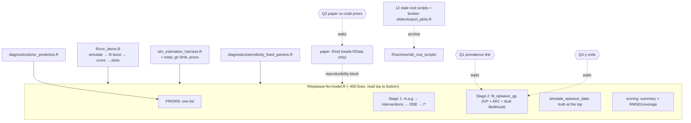

# Change graph — make the model code human and defensible

Date: 2026-10-05 · Owner: Ernest · Built by: Opus 5.5 · Advisor: Fable (independent review)
Spec: Nick Golding's guidance (N-items below), extracted from `meetings/PhD_Work/*`,
`correspondence/*`. The 50-line function limit and the "no dead code" rule in
CLAUDE.md are Ernest's own standards; Nick never said them. Nick did ask for
"change it in one place", names that read like the maths, experiments kept out of
the main script, and "as simple as possible but still realistic".

## 1. The request

| # | Ernest's ask |
|---|---|
| U1 | No code that is "long for the sake of being fancy". It should read like a person wrote it. |
| U2 | I can follow every line and defend it to Nick, Gerry and Dave. Dave asked in Melbourne: "if you wrote that, you need to know what it means". |
| U3 | Use Nick's guidance as the spec. |

### Nick's guidance that constrains the code (full list in the subagent report)

| N | Guidance | Source |
|---|---|---|
| N1–N3 | Fixed parameters → solve the ODE once → I* = m·a·b·z as offset; log I = α + log I* + ε (GP); compare against I* = 0 | `Nick brainwave.txt` |
| N5–N7 | Keep the GP. The dual likelihood identifies α and γ. Prevalence must depend on I, not X | `feedback_from_nick.txt`, 30 Mar 2026 |
| N8 | Prevalence = Σ_τ I(t−τ)·q(τ), the detectability convolution. **"No logit here."** | `nick, punam, susan asking nick.txt` |
| N9 | Spatial GP + AR(1) is fine. Spend effort elsewhere | 30 Mar 2026 |
| N10 | If the sampler hasn't converged, you can't judge the model | 30 Mar 2026 |
| N12 | Only m, a, g vary. b, c, r are fixed | `nick-1.txt` |
| N16 | Focus on Stage 1. Don't polish a toy Stage 2 | Apr 2026 |
| N22 | Simulation script: true parameters at the top, then simulate, fit, check coverage | `Lengthy Chat with Nick about Code.txt` |
| C1 | "you only have to go to one place to change it" | `nick assignment.txt` |
| C2 | Function names look like the maths. Use named arguments | `nick assignment.txt` |
| C3 | Keep experiments in a side script, out of the main process | `nick-1.txt` |
| C4 | "as simple as possible", "not too many parameters" | `nick-1.txt`, 15 Sep 2025 |

## 2. The system today

`R/epiwave-foi-model.R` is 1085 lines and holds everything. It is sourced by:
`R/sim_estimation_harness.R`, `R/diagnostics/prior_predictive.R`,
`R/diagnostics/sensitivity_fixed_params.R`, the paper
(`papers/paper2_epiWaveFOI/objective2_EpiwaveFOI_Model_Paper.Rmd` §reproducibility),
`presentations/slidev/export_plots.R`, `mcmc_background_job.R`, and 8 old root scripts.
The paper's numbers are **read from** `outputs/sim_estimation_results.RData`
(11 Aug 2026). They are not recomputed when the paper renders.

| Block | Lines | What it is | Verdict |
|---|---|---|---|
| Stage 1: `get_fixed_m/a/g`, `apply_interventions` | 37–124 | stand-ins + ITN/IRS multipliers | keep. `get_fixed_m` has a pointless per-site loop. IRS has a bare `0.1` |
| Stage 1: ODE, solver, I* | 131–200 | Ross-Macdonald + deSolve | keep. Drop the unused `is.function` branches and repeated dimension checks |
| Stage 2 helpers | 219–341 | `build_gp_kernel` (one-line wrapper), `ar1` (Nick's), `default_q_daily`, `transform_convolution_kernel` (Nick's), `build_convolution_matrix` | inline the wrapper. Keep Nick's two verbatim with credit |
| Simulation helpers | 344–429 | `simulate_gp_residuals`, `simulate_prevalence_surveys` | `gp_adjustment` argument is dead (always NULL) |
| `fit_epiwave_gp` | 458–570 | the model | 110 lines. A 15-line essay sits on the priors. `requireNamespace` noise |
| `simulate_epiwave_data` | 591–677 | the data-generating process | fine, but times×sites and sites×times are mixed and joined by `t()` calls |
| demo: `.fit_one_model`, `simulate_and_estimate`, `main_example` | 685–790, 1062–1085 | walkthrough | `main_example` wraps the demo and adds nothing. **`if (interactive())` starts a full MCMC on `source()`** |
| plots | 805–996 | 4 ggplot functions | ~200 lines inside the model file |
| metrics | 1008–1048 | summary + RMSE | the harness re-implements the same RMSE/MAE |

## 3. Found while reading (nobody asked)

| F | Finding | Evidence | Action |
|---|---|---|---|
| F1 | **The paper's numbers come from older code.** The 50-replicate study ran on 11 Aug with θ ~ Uniform(0,1) and σ² sampled directly. On 12 Aug `ed7d9a1` changed the code to τ² ~ LogNormal and θ ~ Beta(2,2). The paper's prior table still says Uniform and claims "exactly as declared in `fit_epiwave_gp()`". | `study$meta$date` = 2026-08-11. Paper line ~237 | **Q2** |
| F2 | **The prevalence link is our choice, not Nick's.** Nick's derivation (N8) and epiwave.mapping `sim_data.R` use a *linear* convolution, prev = Σ I·q. Our code uses `1 − exp(−Σ I·q)`, and the comments imply it comes from epiwave.mapping. For small Σ I·q the two agree. Our version is bounded in (0,1). | `R/epiwave-foi-model.R:211-214`, epiwave.mapping `R/sim_data.R` | label it honestly now. **Q1** whether to keep it |
| F3 | Running `source()` in RStudio starts a long MCMC run | line 1083 | remove (B4) |
| F4 | `center_alpha` defaults to FALSE in the demo and TRUE in the study. The paper says all results use TRUE. | lines 464, 729 vs harness | **Q3** |
| F5 | Matrix orientation flips between times×sites and sites×times. epiwave.mapping uses sites×times throughout. This is the biggest reading hazard. | 8 `t()` calls | B3 |
| F6 | `prior_predictive.R` "truncates" γ by clamping. About 2.4% of prior draws sit at exactly 0.001. | `R/diagnostics/prior_predictive.R:31` | fix (cheap, diagnostic only) |
| F7 | 12 root scripts (`test_*.R`, `run_*.R`, `mcmc_background_job.R`) are untracked, date from Feb–Mar, and call the old API | `git status` | B5 |
| F8 | GP hyperparameters have not converged (median R-hat 2.1–4.1). By N10 they say nothing about the model yet. | `study$recovery_summary` | out of scope for this change, but the code should not hide it |
| F9 | CLAUDE.md "use a literature value for a" is out of date. Nick's 1 Jun email says divide m·a by a mapped a. | `correspondence/updates/2026-06-01_*` | tell Ernest. CLAUDE.md is not edited |
| F10 | **γ is not a pure reporting rate.** I is a *daily* rate, but cases are monthly and Poisson(γ·I·N) has no ×days factor. epiwave.mapping multiplies by `month_length_days`, so here γ = reporting rate × step length. The ODE grid uses 30 days while the kernel uses 30.44. (Advisor) | lines 542, 611, 615 | **Q4** |
| F11 | `center_alpha` changes the model, not just the sampler. ε becomes a sum-to-zero field and α estimates α + mean(ε). (Advisor) | line 524 | write it into the model description |
| F12 | The priors are written in two places, `fit_epiwave_gp` and `prior_predictive.R`. That is how F1 slipped through. (Advisor) | | B8 |
| F13 | `study$meta` has no git commit or prior spec, so F1 could only be dated, not proven. (Advisor) | harness | B9 |
| F14 | `presentations/slidev/export_plots.R` is already broken. It calls a `population_matrix =` argument that was removed in March. (Advisor, verified) | `export_plots.R:78` | goes with F7 |

## 4. The graph

There are two files, not five, and no `source()` index. A sourcing index would
break when the paper knits from its own folder. That was the advisor's call, and I
agree.

## 5. Decisions and questions

### Decisions (each reversible with `git revert`)

- **B1 — Behaviour does not change.** The same seeds, priors and likelihood must
  give the same simulated data, bit for bit, and the same greta model. Why: the
  paper, the slides and the RData depend on it. Model changes go through Q1–Q3.
- **B2 — Two files.** `R/epiwave-foi-model.R` holds the model: Stage 1,
  Stage 2, the simulator and scoring, as one narrative with numbered sections.
  `R/run_demo.R` holds the walkthrough and plots. Why: C3/N22 ask for the demo to
  sit outside the model. One model file is easier to defend line by line than four
  files tied together with `source()` (advisor). If wrong: `git revert`.
- **B3 — One orientation: rows = sites, columns = months.** This matches
  epiwave.mapping. Stage 1 returns times×sites because deSolve does, so it is
  transposed **once**, at the Stage 1→2 boundary. Why: removes the scattered
  `t()` calls. Constraint: the random draws must happen in the same order (B1
  test proves it).
- **B4 — Delete wrappers and dead code.** That means `main_example`,
  `build_gp_kernel`, `gp_adjustment`, roxygen `@export` tags (this is not a
  package; argument meanings stay as plain comments), the `interactive()`
  auto-run, and every `requireNamespace` except the greta one. That one stays
  because it points to `R/greta_setup.R`, the most common failure on this
  machine. Comments become plain English, the way Nick writes them in
  epiwave.mapping: *why*, not *what*. The prior essay moves to `docs/` with a
  3-line pointer. Hidden constants (`1e-6` I* floor, `gp_tol`, IRS `0.1`) get
  names once.
- **B5 — Old root scripts and the broken `export_plots.R` go to
  `R/archive/old_root_scripts/`.** They are moved, not deleted.
- **B6 — The harness reuses `compute_performance_metrics`.** One RMSE and one
  coverage, in one place (C1). The coverage arguments therefore stay.
- **B7 — Mark Nick's ported code.** `ar1` and `transform_convolution_kernel`
  stay verbatim with credit lines, so a supervisor sees his own code.
  The prevalence-link comment is corrected (F2): `1 − exp(−Σ I·q)` is labelled
  as *our* bounded form. It is the probability of at least one detectable
  infection, and its first-order term is Nick's linear Σ I·q.
- **B8 — Priors in one place.** A single `PRIORS` list of hyperparameters is
  read by `fit_epiwave_gp` and `prior_predictive.R`. The greta declaration
  order stays the same, so the free-state layout is unchanged. Also fix F6, the
  clamped truncation.
- **B9 — Provenance.** The harness writes `meta$git_sha` and `meta$priors`
  into the study object. This is additive.

### Questions only Ernest (or Nick) can answer

1. **Q1 — Prevalence link.** Today: prev = 1 − exp(−Σ I·q). Nick's derivation and
   epiwave.mapping use prev = Σ I·q, with no transform. Keep ours (and say why in
   the paper), or switch to Nick's linear form? Switching changes results.
2. **Q2 — Paper vs code.** The paper's 50-replicate numbers come from the
   pre-12-Aug priors. Options: (a) rerun the study on Workbench with today's
   priors and update the paper; (b) keep the numbers and fix the paper's prior
   table to say they came from the earlier priors; (c) revert the priors.
3. **Q3 — `center_alpha`.** Should it default to TRUE everywhere (as in the paper),
   or stay FALSE in the demo?
4. **Q4 — γ units (for Nick).** Today: cases ~ Poisson(γ·I·N), with I per day
   and a 30-day step, so γ also carries the step length. Should we add the
   ×days factor, as epiwave.mapping does, so γ is a true reporting proportion?
   This changes results.

### How "nothing changed" is proven (written before any edit)

The reference is frozen from HEAD in the session scratchpad.
1. The simulated data are `identical()` for the demo seeds, harness replicate 1,
   and a small no-intervention case.
2. For the greta model, five configs are checked: with/without offset ×
   center_alpha T/F, plus one with inducing points. Each must match on three
   things: the free-state length, the joint log-density at three pinned points
   (`dag$generate_log_prob_function`), and a 20-iteration seeded MCMC with fixed
   initial values (`all.equal`, tolerance 1e-10).
3. The diagnostics scripts run, the harness runs one tiny replicate, and the demo
   runs at a tiny size.

### Phases

- **Phase A (safe now):** B1–B7, plus the F6 fix and an honest label on F2.
  The numbers do not change.
- **Phase B (waits on Q1–Q3):** any model change, the study rerun, and paper edits.

## 6–8. Results (Phase A, built 2026-10-05)

| What | Before | After |
|---|---|---|
| `R/epiwave-foi-model.R` | 1085 lines, model + demo + plots | 439 lines, 5 numbered sections, model only |
| `R/run_demo.R` | — | 118-line top-to-bottom walkthrough + plots |
| matrix orientation | mixed, 8 `t()` calls | `[n_sites x n_times]` everywhere, no transposes |
| priors | written twice | `PRIORS` list, read by the model and the prior predictive check |
| root `.R` scripts | 12 stale | 0 (moved to `R/archive/old_root_scripts/` with `export_plots.R`) |

**Proof that the numbers did not move** (`tests/refactor_equivalence.R`; reference
frozen from commit 344d873 into `cache/refactor_reference_2026-10-05.rds`):
- The test passes on unchanged code. It fails when a prior moves by 0.01
  (Beta(2,2) → Beta(2,2.01)), which shows it can detect a change.
- Simulated data is `identical` for the demo seeds, harness replicate 1, and a
  no-intervention case.
- The greta model has the same free-parameter count (83, or 44 sparse) and the
  same joint log-density at 3 pinned points, in all 5 configurations.
- The sensitivity diagnostic is identical. The prior predictive is identical
  except γ, which was fixed on purpose (F6). Under the old clamping, 5 of 200
  draws sat at 0.001; now none do. Median prior-predictive cases went from
  195.8 to 199.2.
- The harness ran one tiny replicate end to end and now records
  `meta$git_sha` and `meta$priors`.
- The demo ran end to end at a tiny size (4 sites, 8 months, 30 samples).

**Not verified:** a full-size demo or a full harness run (hours). The paper was
not re-knitted. Its numbers come from the saved RData, which is unchanged.

**Still waiting:** Q1 and Q4 (Nick); Q2 and Q3 (Ernest).
