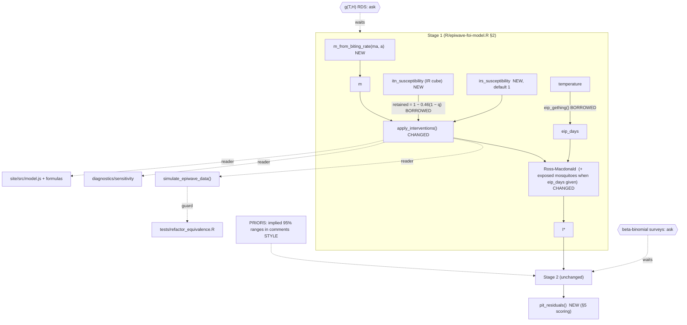

# Change graph — borrow from the Vector Atlas group's models and code

Date: 2026-10-06 · Built by Opus 5.5 · Advisor: Fable
Ask: "These are my group's models. Make useful changes to my code where
necessary, borrow what they use, and adopt the parts of their style that
meaningfully improve mine. It can be updated later."
Inputs: `LESSONS_GRAPH.md` (this folder). The group's code, read from HEAD on
2026-10-06: goldingn/ir_cube, geryan/va_multispecies_sdm,
geryan/anopheles_stephensi_expansion, modd-africa/hackthon2026.

## 1. Asks

| # | Ask |
|---|---|
| C1 | Change the code where the group's models show a better way |
| C2 | Borrow their actual functions and parameter values where they exist |
| C3 | Adopt the parts of their coding and modelling style that improve readability and defensibility |

## 2. What exists to borrow (verified in the source)

| Piece | Where | Usable now? |
|---|---|---|
| **ITN effect retained under resistance**: `1 − 0.46 (1 − susceptibility)` (Symons et al., posterior mean; at 0% susceptibility nets keep 54% of their effect) | `ir_cube/R/fig_ento_epi_impact.R:83` | **Yes** |
| IR-cube susceptibility surfaces (input to the line above) | ir_cube outputs | Interface now, data later |
| **EIP from temperature**: Gething degree-day `111 / (T − 16)`; Briere PDR with `c = 1.08e-4, T_min = 16, T_max = 35` | `hackthon2026/EIP.R`, `PDR.R` | **Yes** |
| Adult survival g(T, H): GAM, field-corrected to 0.83/day at Ifakara | `anopheles_stephensi_expansion/R/estimate_lifehistory_parameters.R` | **No.** The fitted object and the Bayoh data are gitignored. Ask for the dehydrated RDS |
| Biting rate a(T, H): Briere temperature offset × fitted humidity multiplier | `hackthon2026/temp_humid_biting_estimation.R` | **Partly.** The humidity lookup was never written out. Nick's fit is "very close" |
| Beta-binomial `betabinomial_p_rho()` for overdispersed surveys | `ir_cube/R/functions.R:106` | Possible, but it **changes the Stage 2 likelihood**. Question for Nick |
| Posterior/prior predictive checks with `greta::calculate()`, plus DHARMa randomised quantile residuals | `va_multispecies_sdm/R/validation_and_checking.R` | **Yes.** DHARMa is not installed here; the residual is simple to compute directly |
| Prior derivation documented in comments (tail probability → sd) | `ir_cube/R/fit_model.R` | **Yes** |

## 3. Today, in our code

- `apply_interventions()` (R/epiwave-foi-model.R:96): one `resistance_index`,
  used linearly (u = 1 − resistance) for **both** ITN and IRS. At full resistance
  nets have **zero** effect. That contradicts the group's fitted relationship and
  physical sense: nets still block bites.
- `ross_macdonald_ode()` (:119): no extrinsic incubation period, and c fixed.
- No helper to turn the interim m·a maps into m.
- The PRIORS comment gives no implied ranges.
- No residual check for the likelihoods.
- Readers: `simulate_epiwave_data()`, `R/diagnostics/sensitivity_fixed_params.R`,
  the study site (`site/src/model.js` port and formula sheet), and
  `tests/refactor_equivalence.R`.

## 4. Found while reading

- **F1 — Nets lose all effect at full resistance in our model.** u = 1 − 1 = 0.
  The group's function keeps 54%.
- **F2 — The ITN multiplier currently scales IRS too.** IRS actives are mostly
  non-pyrethroid, so ITN-pyrethroid resistance should not reduce them.
- **F3 — The EIP is absent.** At g = 0.1 and a 10-day EIP, only about
  e−1 ≈ 37% of infected mosquitoes live to become infectious. Our R₀
  and I* are inflated by roughly that factor.

## 5. The graph

## 6. Decisions (each reversible with `git revert`)

- **B1 — Resistance through the group's function.** `apply_interventions()`
  takes `itn_susceptibility` (the IR-cube quantity, 0–1). The ITN effects are
  scaled by `1 − 0.46 (1 − itn_susceptibility)`. `irs_susceptibility` is separate
  (default 1) and scales IRS linearly. This is the cue for the per-insecticide
  layer later. `resistance_index` is removed.
  *Caveat, stated in the code:* the 0.46 comes from an epidemiological
  (logit-PfPR) analysis. Applying it to the entomological multipliers is an
  approximation.
  *Effect on numbers:* the simulation's 20% resistance (susceptibility 0.8)
  keeps 90.8% of the ITN effect instead of 80%. I* changes slightly. The
  reference for the equivalence test is re-frozen, and the diff is recorded.
- **B2 — EIP is opt-in.** `solve_ross_macdonald_multi_site(..., eip_days = NULL)`.
  NULL keeps today's 2-state model **bit-identical**. A number or matrix adds an
  exposed-mosquito compartment: dy/dt = a c x (1 − y − z) − (g + 1/n) y and
  dz/dt = y/n − g z. A fraction 1/(1 + g n) of mosquitoes survive the EIP: an
  exponential approximation to e−gn. `eip_gething(temperature)` is
  borrowed from the hackathon code. The simulation keeps it **off** until Nick
  agrees, because switching it on changes every result.
- **B3 — `m_from_biting_rate(ma, a)`** = ma / a, with a check that a > 0.
  Additive.
- **B4 — `pit_residuals()`**: randomised quantile residuals for Poisson cases
  and Binomial surveys from posterior predictive draws. Uniform residuals mean
  the model can reproduce the data. Written directly (no DHARMa dependency), the
  same quantity DHARMa computes. Additive; the demo gains one histogram.
- **B5 — Style borrowed where it helps.**
  - The PRIORS block states the implied 95% range of each prior on an
    interpretable scale, as `ir_cube/R/fit_model.R` does.
  - Each borrowed function carries its source file and reference in one comment
    line.
  - Arguments are written one per line in calls with several arguments (their
    AGENTS.md).
  - Comments only where the reasoning is not obvious.
  - Not adopted: targets pipelines, many-chain HMC tuning. Those suit their
    multi-day fits, not this repo.
- **B6 — Keep the site in step.** Port B1 and B2 into `site/src/model.js`,
  extend the JavaScript tests against R, and update the formula sheet and
  interventions chapter.

### Added after reading the 2024 training material
(`idem-lab/vector_atlas_training_2024`, also in `docs/vector_atlas/`)

The training teaches three things that apply directly:
- **The spatial-smoothing deck** (slides 18–20) combines a covariate model and a
  spatial smooth "to fit data well, but also extrapolate". That is our design.
- **The niche-model practical** says internal validation is "the easiest *but the
  most misleading*", that "the whole point of mapping is to predict to new
  locations", and then uses a held-out split and K-fold cross-validation.
- **Model criticism** includes a binned calibration plot: fitted probability in
  bins against the observed proportion.

- **B7 — Calibration check for surveys.** `calibration_table()` bins predicted
  survey prevalence and compares it with observed positives/tested in each bin,
  as the practical does for presence probabilities. Additive; one plot in the
  demo.
- **B8 — Held-out sites in the fit.** `fit_epiwave_gp(..., observed_sites = NULL)`
  keeps the GP over all sites but attaches the case and survey likelihoods only
  at observed sites. NULL means all sites, so the model is identical to today.
  The harness gains `holdout_fraction` (default 0) and scores the map at
  held-out sites. This is the out-of-sample test the training material and the
  IR-cube plan both call for.
- **B9 — Spatial signal in the simulated entomology.** `simulate_epiwave_data(...,
  site_variation = FALSE)`. When TRUE, sites differ in ITN coverage and
  susceptibility (using B1), so I* varies in space. FALSE is identical to today.
- **B10 — Script layout as in the training scripts.** `run_demo.R` opens with a
  numbered outline of its steps, and the body uses the same numbers.

Proof for B7–B10: with defaults, the equivalence test is untouched. New checks:
- held-out sites contribute no likelihood (the model's log-density does not
  change when their data change);
- `site_variation = TRUE` gives a non-zero spread of I* across sites;
- a tiny harness run with `holdout_fraction = 0.3` completes and reports
  held-out scores.

## 7. Questions (only these change what gets built)

1. Can I have the dehydrated g(T, H) survival function
   (`ds_temp_humid.RDS`) and, when ready, the humidity biting lookup?
2. Switch the EIP on in the simulation study (it changes every result)? With
   Gething's form, or Stopard's?
3. Should the survey likelihood become beta-binomial (`betabinomial_p_rho`), as
   in the IR cube?
4. Is the Symons 0.46 retained-effect estimate acceptable for the entomological
   multipliers, or is there an entomological version (e.g. hut-trial killing
   curves)?

## 8. Phases

- **Phase A (build now):** B1–B6.
- **Phase B (waits on answers):** g(T, H), a(T, H) humidity, EIP on in the study,
  beta-binomial surveys.

## 9. Proof plan (written before building)

1. `tests/refactor_equivalence.R`. Before B1, it must still pass with B2–B5 in
   place: EIP off and additive helpers change nothing. After B1, record the
   expected diff (I* and everything downstream) and re-freeze. Stage 2's
   log-density at the same data stays identical, because Stage 2 is untouched.
2. New `tests/stage1_checks.R` (no greta):
   - full susceptibility gives the old ITN result exactly;
   - zero susceptibility keeps 54% of each ITN effect;
   - IRS is unaffected by ITN susceptibility;
   - `eip_days` NULL is identical to before;
   - with a long EIP, I* falls and equilibrium R₀ scales by 1/(1 + g n);
   - `m_from_biting_rate` inverts m·a;
   - PIT residuals of data simulated from the model are uniform
     (Kolmogorov–Smirnov p > 0.01).
3. Diagnostics run; the harness runs one tiny replicate; site JS tests pass
   against new R references.

## 10. Results (built 2026-10-06)

**Dropped before pushing, at Ernest’s request (only what the supervisor’s guidance makes necessary):** B4 PIT residuals and B7 the calibration table, including their demo step and checks. Both were borrowed diagnostics that had not been asked for.

Changes made after the advisor's plan review:
- Resistance enters as **effective ITN coverage**, n′ = n (1 − 0.46 (1 − q)),
  matching the source comment's framing.
- The EIP uses **4 exposed stages**: survival (1 + g n/4)⁻⁴ is 0.41 at
  g n = 1, against an exact 0.37; one stage would give 0.50.
- Corrected claim: leaving out a 10-day EIP **inflates I\* about 3.3×** (check
  output), not by 37%.
- PIT is tested at the truth (exact, no greta); the posterior version is a
  diagnostic in the demo.
- The m·a helper warns about double-counting net effects.

| Check | Result |
|---|---|
| `tests/stage1_checks.R` (19 checks, written first, red before the build) | all pass |
| Old greta model vs new on **identical data** (with and without I\*) | identical log-density to commit 344d873 |
| Held-out sites contribute no likelihood (their data changed → same log-density; control differs) | pass |
| No-intervention simulation | bit-identical to before (only `true_params` gains 2 entries) |
| Intervention simulation (expected change, B1) | I\* median ×0.94, range ×0.75–1.00; total cases 156,399 → 150,960 |
| `tests/refactor_equivalence.R` | re-frozen to `cache/refactor_reference_2026-10-06.rds` (2026-10-05 kept); passes |
| Harness, 1 tiny replicate with `holdout_fraction = 0.3`, `site_variation = TRUE` | runs; reports held-out RMSE and coverage |
| Demo, tiny size, with PIT histograms and calibration table | runs |
| Diagnostics (prior predictive, sensitivity) | run. Prior draws are now seeded after the simulator, so they no longer depend on its data |
| Site: JavaScript port of the new resistance path and EIP, against R | 13/13 pass (EIP within 0.01% of deSolve) |
| Site export | replicate 1 rebuilt with the study's own simulator (commit 64a06b9), so the "real fit" pages still match the saved study |

**Not verified:** a full-size demo or study run (hours). The site has not yet been
redeployed to Vercel.

**Still waiting (questions §7):** g(T, H) RDS; whether to switch the EIP on in
the study; beta-binomial surveys; whether the 0.46 mapping is acceptable.
