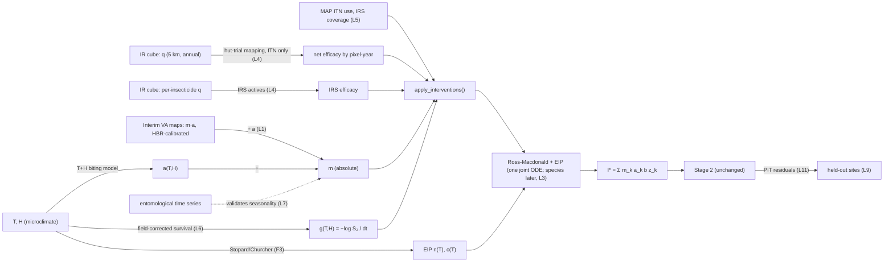

# What the Vector Atlas models teach EpiWave-FOI

Date: 2026-10-06 · Built by Opus 5.5 · Advisor: Fable (reviewed; corrections applied)
Sources: `docs/vector_atlas/` — three technical summaries:
species distributions (SDM), insecticide-resistance space-time cube (IR cube),
and the *An. stephensi* spread model. All three are greta / greta.dynamics models.
Also used: the 1 June 2026 email on VA layers
(`correspondence/updates/2026-06-01_reply_from_nick_va_layers_mosmicrosim.md`).
Compared against `R/epiwave-foi-model.R` at commit 64a06b9.

## 1. The question

Is there anything in these three models that EpiWave-FOI should learn from, adopt,
or prepare for?

## 2. What each document says (only the parts that touch our model)

| Doc | What it produces | What matters for us |
|---|---|---|
| **SDM** | Probability of occurrence for 11 *Anopheles* taxa, 1 km, static. Abundance is listed as a *next step*. | λl,k is relative abundance, "the density … that would be detected by this sampling methodology". Presence–absence uses **p = 1 − exp(−λ a)**, "the probability of detecting one or more individuals under a Poisson sampling distribution". The team *explores* offsets from biomechanistic models, but the presented results use an **expert range-map offset**. |
| **IR cube** | Proportion of *An. gambiae* complex susceptible, per insecticide and as the single-AI LLIN pyrethroid composite (deltamethrin 57%, permethrin 22%, alpha-cypermethrin 21%). 5 km, **annual 1995–2030**. | A mapped replacement for our scalar `resistance_index`. Covariates are MAP-modelled **ITN use** (2000–2022) and WHO/MAP **IRS coverage** (1997–2022); after 2022 they are held constant. The validation plan separates interpolation (geostatistics expected to win) from **extrapolation to unsampled regions** (the mechanistic model expected to win). Fit is checked with randomised quantile (PIT) residuals. |
| ***An. stephensi*** | Suitability and annual distribution, 5 km. | Adult daily survival as a function of **temperature and humidity**: a GAM Cox model fitted *jointly to An. stephensi and An. gambiae complex* lab data, with a **field correction anchored at Ifakara, Tanzania**. Climate inputs are a **1961–1990 climatology** passed through a microclimate model. Absolute abundance and detection effort are stated to be **not identifiable**, so both are relative. Its own seasonality check failed in 3 of 4 sites, and the doc concludes the model is "unlikely to provide useful insight into temporal abundance". |

All three describe themselves as **semi-mechanistic**: a mechanistic process for
what is understood and a correlative part for what is not, solved per pixel,
with R̂ < 1.1 as the convergence target. The IR cube and stephensi prior tables
state the **95% prior mass implied on interpretable quantities**. Only the IR cube
reports PIT residual checks.

## 3. Lessons, mapped to our code

| L | Lesson | Our model today | What it means for us | Priority |
|---|---|---|---|---|
| L1 | **Know which scale the m input is on.** The interim abundance maps are *calibrated against human biting data*, so they give **m·a on an absolute bites-per-person-per-day scale** (1 June email); m = (m·a)/a once a is mapped. The SDM's relative λ is a different product. | `get_fixed_m()` assumes an absolute m | If the maps really are absolute human biting rate (HBR), the scale is anchored and L1 is closed. If any input is only relative, the scale matters because z is non-linear in m. **Near R₀ = 1 the effect is huge**: doubling m from 0.25 to 0.5 multiplies equilibrium I* by about 127 (R₀ 1.0 → 2.0). **Above m ≈ 1 it is nearly proportional** (×2.3 from m = 1 to 2), and α absorbs it. The scale decides which pixels fall to the I* floor (log 10⁻⁶ ≈ −13.8), which the GP must then undo. Anchor it externally (HBR calibration, EIR). Do *not* choose it by comparing fits: that is inference on a dynamic parameter, against the design, and with the GP and α absorbing misfit it would tell you little. | **High** |
| L2 | **Turning occurrence into a relative abundance, with care.** p = 1 − exp(−λa) gives −log(1 − p) = λ·a. | not used | Valid only within one species and at a fixed reference area. It is not comparable across species (species-specific intercepts and detection). It saturates as p → 1, exactly where abundance is high. The expert range-map offset is baked in. A fallback, not a plan. | low |
| L3 | **Several vector species.** The SDM maps arabiensis, funestus, gambiae, coluzzii and others separately. | One mosquito population | FOI = Σk mk ak b zk. The species are **coupled through shared human prevalence**: dx/dt = Σk mk ak b zk (1 − x) − r x. That is one joint ODE with K mosquito compartments, not K separate solves. The only species-resolved VA input today is relative occurrence, so this comes **later**, as a two-taxon sensitivity. | later |
| L4 | **Resistance is now a map, and it should not enter linearly.** IR cube: susceptibility q per pixel-year. | `resistance_index = 0.2` constant (line 384), used as u = 1 − resistance for **both** ITN and IRS | Feeding 1 − q into today's code would make u = q, the linear bioassay → efficacy mapping that hut trials contradict. Use a published relationship from bioassay survival to net killing and deterrence (Churcher et al. 2016; Sherrard-Smith et al. 2022, Lancet Planetary Health). Use the **composite for ITNs only**, and only for single-AI nets, not PBO or dual-AI. Use the **per-insecticide layer for IRS**, whose actives are mostly non-pyrethroid. Interpolate annual to monthly. It covers *An. gambiae* complex only. | **High** |
| L5 | **The intervention inputs already exist as maps.** MAP ITN use and WHO/MAP IRS coverage. | Synthetic ITN ramp 0 → 0.7 | Use the same layers for `itn_coverage` and `irs_coverage`. They put real spatial variation into I*, which the simulation currently lacks (alignment finding F2). Values after 2022 are held constant. | medium |
| L6 | **g(T, H) is nearly ready-made.** The stephensi survival model was fitted jointly with *An. gambiae* T+H data and field-corrected in Tanzania. | `get_fixed_g()` constant at 1/10 | g = −log(S₂)/dt from that model gives a temperature- and humidity-dependent death rate for your vectors. Pair it with the T+H biting rate from the hackathon code (the task from the 1 June email). Mosquitoes experience microclimate, not weather-station conditions. | medium |
| L7 | **Seasonality must be validated against entomological time series.** The stephensi climate model failed to reproduce seasonality in 3 of 4 sites. | `get_fixed_m()` uses a toy sinusoid | Climate-driven suitability is **not** automatically a good seasonal m. Whatever drives the seasonal shape of m (including the interim maps), check it against catch time series and report the failures too. | medium |
| L8 | **The bounded prevalence link has precedent in the group's work.** The SDM uses the same Poisson "at least one" form, p = 1 − exp(−λa). | Q1 open: bounded or linear | This supports the bounded form, but it is not universal: **epiwave.mapping itself uses the linear sum**. The argument for Q1 is the Poisson reasoning plus the high simulated incidence, not convention. | supports Q1 |
| L9 | **The validation design matches the redesign.** IR cube: interpolation vs extrapolation to unsampled regions. | Map scored only where data exist (alignment F3) | Same logic as the held-out-site proposal. Cite it as the group's planned standard. | supports R1 |
| L10 | **Write the prior table with implied quantities** (as the IR cube and stephensi tables do). | Paper prior table has no implied quantities | For example: γ ~ N(0.1, 0.05), truncated at 0.001, puts 95% mass on 0.017–0.20. τ² ~ LogNormal(−0.5, 0.5) puts 95% mass on 0.23–1.62, so a site one standard deviation above the mechanism is 1.6–3.6 times I*. Add φ's implied correlation at the largest site distance. | small |
| L11 | **Check fit with PIT / Dunn–Smyth residuals** (as the IR cube does). | R-hat, RMSE and coverage only | Add randomised quantile residuals for cases and surveys, and map them to look for spatial pattern. | small |
| L12 | **Same family, same words.** The VA models are "semi-mechanistic" and explore "offsets from biomechanistic models". | The paper says "two-stage" | Use that vocabulary in the paper. | wording |

## 4. Found while reading (nobody asked)

- **F1 — Temporal signal in I* will be a repeated annual cycle.** Climate inputs
  here are climatologies (1961–1990 in the stephensi model) and ITN layers stop
  in 2022. The mechanistic offset will carry seasonality and the intervention
  trend, but **year-to-year anomalies must come from the AR(1)/GP**. For a
  space-*time* model, say so explicitly.
- **F2 — I* in the simulation is on an unphysical scale.** 0.3 infections per
  person per *day* is about 100 per year. On real data α would need to be around
  −4 to −5, outside its N(0, 1) prior. Revisit the α prior, or the baseline m,
  before fitting real data. The interim HBR-calibrated maps will make this
  concrete.
- **F3 — Items from the 1 June email are still missing from the ODE.**
  Temperature-dependent EIP n (Stopard/Churcher) and c (a "quite a strong
  effect", today fixed at 0.8). The current Ross-Macdonald has **no sporogony
  delay** at all.
- **F4 — The IR cube is gambiae-complex only, annual, and still awaiting
  cross-validation.** Treat it as an uncertain input, using the 25th/75th
  sensitivity check suggested in Melbourne.

## 5. The graph

Everything on the left feeds `get_fixed_m/a/g()`, `apply_interventions()` and the
ODE. Stage 2 does not change. That separation is what the refactor protected.

## 6. Recommendations

**Now (no new data needed)**
1. Confirm the scale of the interim maps (L1), and settle the α prior against
   realistic incidence (F2) before any real-data fit.
2. Rewrite the resistance path (L4): a hut-trial mapping, ITN and IRS separated.
   Until real layers arrive, give sites different ITN coverage and resistance in
   the simulation redesign (L5). That puts spatial signal into I*.
3. Prior table with implied quantities (L10); PIT residuals in the harness
   (L11); "semi-mechanistic" wording in the paper (L12).

**Next (Stage 1 build, in this order)**
4. a(T, H) from the hackathon code, then m = (m·a)/a.
5. g(T, H) from the field-corrected survival model (L6).
6. EIP and c(T) in the ODE (F3).
7. Check the seasonal shape of m against catch time series (L7).

**Later**
8. Multi-species FOI as a two-taxon sensitivity (L3).

**Questions to raise (one line each)**
1. Are the interim maps on an absolute human-biting-rate scale, and against which
   catch method were they calibrated?
2. For resistance → net efficacy, should I use Sherrard-Smith et al. (2022), and
   handle IRS separately with the per-insecticide layers?
3. Given realistic incidence, should the α prior be centred on log(realistic
   incidence ÷ typical I*) rather than 0?
4. Since the mechanistic offset will repeat the same annual cycle each year
   (climatology), is it right to leave interannual variation to the AR(1)?
