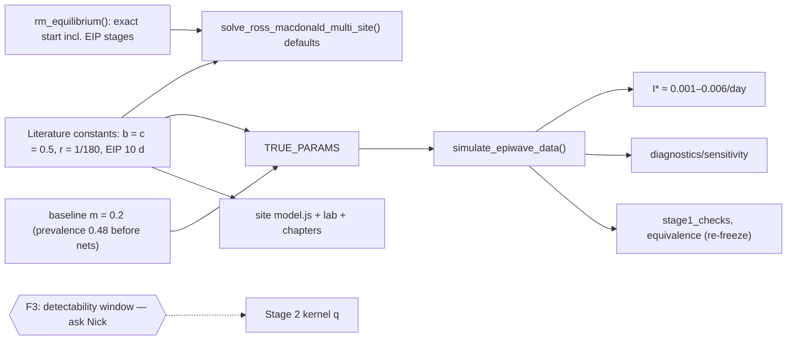

# Change graph — Stage 1 parameters into literature ranges

Date: 2026-10-07 · Built by Opus 5.5 · Advisor: Fable
Ask (Ernest): "If there is a need to fix parameters to be in the right ranges, let's do it now."
Guidance it rests on: Stage 1 uses **fixed values from the literature**. The 1 June
email asks for the **EIP (Stopard/Churcher)**.

## 1. What is out of range (literature check, PubMed-sourced)

| Parameter | Simulation now | Literature | Source | Verdict |
|---|---|---|---|---|
| r | 1/7 day⁻¹ (7-day infection) | infections last "about six months" | Smith, Dushoff, Snow & Hay 2005, *Nature* 438:492, PMID 16306991 | **25× too short** |
| b | 0.8 | 0.5 | Smith & McKenzie 2004, *Malar J* 3:13, PMID 15180900 | high |
| c | 0.8 | 0.5 ("agrees with direct-feeding experiments") | Smith et al. 2007, *PLoS Biol* 5:e42 | high |
| EIP | off by default | EIP50 8.8–16.1 d over 34–21 °C; Gething 111/(T−16) gives 10.1 d at 27 °C | Stopard, Churcher & Lambert 2021, *PLoS Comput Biol*, PMID 33591963; Gething et al. 2011, PMID 21615906 | **missing** |
| a | 0.3 | 0.3 | Smith & McKenzie 2004 | ok |
| g | 0.1 (p ≈ 0.90) | p 0.73–0.92 by method; parity 0.83 | Matthews et al. 2020, *Parasit Vectors*, PMID 32381111 | ok |
| Prevalence | 0.68 at equilibrium | Mozambique 2018 MIS: 38.9% national, 1–57% by province | Ejigu 2020, *PLoS One*, PMID 33166322 | **above every province** |

**Consequence.** With 7-day infections, holding 68% of people infected needs a
force of infection of about 0.1–0.3 per person per day (35–100 infections a
year). That is why I* was unphysical and α would have needed about −4 on real
data.

## 2. The system today

- `solve_ross_macdonald_multi_site()`: defaults b = c = 0.8, r = 1/7, and starts
  from x0 = 0.01, z0 = 0.001.
- `TRUE_PARAMS`: baseline_m = 2, b, c, r as above; EIP not used.
- Readers:
  - `simulate_epiwave_data()`;
  - `R/diagnostics/sensitivity_fixed_params.R` (passes TRUE_PARAMS);
  - `tests/stage1_checks.R`;
  - `tests/refactor_equivalence.R`;
  - site: `model.js` defaults, Stage 1 lab, chapter worked examples (R₀ 8.06 …),
    `export_data.R` refs.
- **Not a reader:** the study site's "real fit" pages. They rebuild replicate 1
  with the study's own code (commit 64a06b9), so they stay as they are and are
  labelled as the earlier parameters.

## 3. Found while working it out

- **F1 — Starting values.** With 6-month infections, starting from x0 = 0.01
  gives years of artificial build-up inside a 4-year simulation. The run must
  start at the equilibrium of the starting conditions.
- **F2 — Homogeneous Ross-Macdonald cannot match field EIR and prevalence at the
  same time.** At 48% prevalence it implies an annual EIR of about 4, against
  tens to hundreds in high-transmission field data. This is a known limitation
  (Smith et al. 2005: heterogeneous biting). Matching prevalence keeps the force
  of infection, and so I*, realistic. Document it; do not hide it.
- **F3 — The Stage 2 detectability window (30 days) no longer matches a 6-month
  infection.** Surveys simulated through Stage 2 would show about 7% prevalence
  where the ODE says about 40%. Fixing this changes the Stage 2 kernel q, which is
  Nick's specification and epiwave.mapping's placeholder. **Ask first, do not
  change.**

## 4. Graph

## 5. Decisions (reversible with `git revert`)

- **D1 — One block of literature constants** in section 1:
  `TRANSMISSION <- list(b = 0.5, c = 0.5, r = 1/180, eip_days = 10)`, each with
  its citation. The solver defaults and TRUE_PARAMS both read it.
- **D2 — EIP on in the simulation** at 10 days (Gething at 27 °C; within
  Stopard's 8.8–16 d). The solver default stays `eip_days = NULL`, for callers
  who want the bare model.
- **D3 — Baseline m = 0.2.** Equilibrium prevalence before nets is 0.48, the
  force of infection 1.9 per person per year, and R₀ 3.3. As nets scale to 70%,
  prevalence falls toward Mozambique-like levels. With real data, m comes from
  (m·a)/a instead.
- **D4 — Start at equilibrium.** `rm_equilibrium()` gives the exact steady state
  of the model with EIP stages (z* = S·acx/(acx + g), with the exposed classes
  in proportion). The simulator starts each site there, using its month-0
  parameters. The solver default start is unchanged.
- **D5 — Everything downstream moves on purpose.** The equivalence reference is
  re-frozen (old ones kept). The site is updated: lab defaults, chapter worked
  examples, and a note that replicate 1 used the earlier illustrative values.

## 6. Proof plan

- `stage1_checks.R` gains these checks:
  - rm_equilibrium is a fixed point: the ODE started there stays there (constant
    parameters, 1 year, relative change < 1e-6);
  - baseline equilibrium prevalence is 0.48 ± 0.01;
  - mean simulated I* is between 0.001 and 0.01 per day.
  Existing checks stay green.
- Equivalence: the Stage 2 log-density is identical on identical data
  (re-checked against commit 344d873). Simulated data are re-frozen.
- The site's JavaScript is re-tested against new R references.
- Tiny demo and harness runs complete.

## 7. Question to raise (Phase B)

The detectability window q (30 days) was a placeholder. With 6-month infections,
should q follow the infection's duration (e.g. q(d) ∝ e^{−r d}, horizon around 2
years), keeping Stage 1 and Stage 2 consistent? That changes the Stage 2 kernel,
and early months need a pre-sample history.

## 8. Results (built 2026-10-07)

Advisor changes adopted:
- **D6 — case likelihood units.** I is per day and cases are per month, so
  expected cases are now γ · I · N · 30, as epiwave.mapping does. Without it,
  realistic incidence gave about 3 expected cases per site-month and γ silently
  absorbed the factor 30. Proven exact: the new model's log-density equals
  commit 344d873's with population × 30 (with and without I*).
- m = 0.2 kept. The 48-month net scale-up takes R₀ to about 1.07, so prevalence
  declines throughout rather than settling. This is stated in the code.
- Month-0 equilibrium start kept. Fable measured it 4.6% below the seasonal
  attractor in x and under 1% in I* by month 6.

| Check | Result |
|---|---|
| `tests/stage1_checks.R` (25 checks; new: equilibrium fixed point with/without EIP, prevalence before nets 0.481, I* realistic, no floor hits, informative case counts) | all pass |
| Simulated replicate (seed 1010) | I* mean 0.0028/day (≈1 per person per year), range 2.9e-4 to 7.3e-3; ODE prevalence 0.41 → 0.17; median expected cases 80 per site-month |
| Case-units change == old model with population × 30 | identical log-density |
| Equivalence | re-frozen to `cache/refactor_reference_2026-10-07.rds` (earlier references kept); passes |
| Prior predictive | median prevalence 0.04, median cases 70 (was saturated near 1) |
| Sensitivity (±20% on m, a, g) | I* moves 29–47% |
| Harness (holdout 0.3, site_variation) and demo, tiny size | run |
| Site JS vs R (new defaults, equilibrium start, no-EIP variant) | 15/15 pass |

**Not changed (Phase B, question for Nick):** the 30-day detectability window
(F3). Stage 2 survey prevalence (~5%) is far below the ODE's (~40%).
The study's 50-replicate results used the old values and need rerunning.
