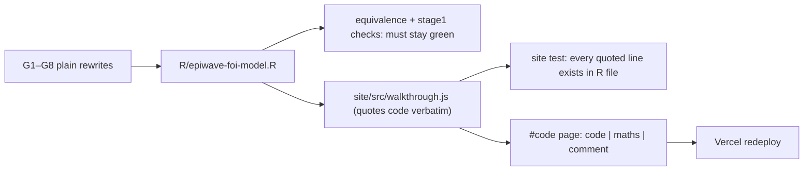

# Change graph — plain code, and a line-by-line walkthrough on the site

Date: 2026-10-07 · Built by Opus 5.5 · Advisor: Fable
Asks (Ernest):
- **C1** — "My main code has to read neatly: no complex gymnastics or fancy
  code, something straightforward, in Nick's style."
- **C2** — On the Vercel site: the code run line by line, side by side with the
  mathematical language, plus a comment, so each line can be understood.

## 1. Gymnastics found in R/epiwave-foi-model.R (most added this week)

| G | Where | Today | Plain version |
|---|---|---|---|
| G1 | solver, starting state | `st <- if … else if … else`, `st[] <- lapply(…unname…)`, 200-char `y0` one-liner | an `if / else` block; `rm_equilibrium()` returns plain numbers; exposed classes set in a short block; drop the unused "start = list" option |
| G2 | `ross_macdonald_eip_ode` | `dy_dt <- c(new, leave * y[-k]) - (g + leave) * y` | a loop over stages: inflow into stage i, minus deaths and moving on |
| G3 | both ODEs, simulator | `m <- …; a <- …; g <- …` on one line | one assignment per line |
| G4 | `build_convolution_matrix` | `outer()` + logical indexing (my day-one change) | back to the plain double loop |
| G5 | `fit_epiwave_gp` survey filter | `%%` and `%in%` in one line | name `survey_site` first, then an `if / else` |
| G6 | simulator ITN set-up | two inline `if … else` and `outer()` | an `if / else` block; one comment on `outer()` |
| G7 | PRIORS comment | says I* is "far too high" (no longer true) | correct it |
| G8 | file header | cases formula has no days factor; no EIP | correct it |

Left as is:
- `ar1()` and `transform_convolution_kernel()`: Nick's own code; keeping them
  verbatim is the point.
- `uniroot` in `rm_equilibrium`, with a comment.

**Constraint:** numbers must not move. The equivalence test against
`cache/refactor_reference_2026-10-07.rds` and all 25 Stage 1 checks must pass
unchanged.

## 2. The walkthrough page (C2)

- A new site page, **Code walkthrough**: one section per function, in file
  order. Each line of code sits in a three-column row:
  **code | the maths it computes | what it does, in words**.
  On a phone the three stack.
- Content lives in `site/src/walkthrough.js`. **Anti-drift test:** every code
  line quoted there must appear verbatim in `R/epiwave-foi-model.R`, or the site
  test fails. If the code changes, the page cannot silently go stale.
- Coverage:
  - constants;
  - m, a, g;
  - interventions;
  - EIP;
  - both ODEs;
  - the equilibrium;
  - the solver (key lines);
  - I*;
  - AR(1);
  - detectability (kernel, matrix);
  - the whole of `fit_epiwave_gp`;
  - the simulator (key lines).
  The data-wrangling pipeline inside Nick's kernel transform is summarised as a
  block, not line by line.
- Maths written plainly: x, z, I*, α, γ with sub/superscripts. Each comment says
  *what it does and why*, in the student's voice, with no supervisor names.

## 3. Graph

## 4. Proof

- `tests/stage1_checks.R` (25 checks) and `tests/refactor_equivalence.R` pass
  with **no re-freeze**.
- The site test checks every walkthrough line against the R file.
- Page checked in the browser on desktop and at phone width.
- Fable reviews the walkthrough's maths before deploy.

## 5. Results (2026-10-07)

**Plain rewrites (G1–G8, plus the advisor's extra spots):**
- solver start → if/else blocks, named `start_state`;
- EIP ODE stages → a loop;
- `build_convolution_matrix` → double loop;
- survey filter → `survey_site`, then `survey_used` and `survey_cells`;
- `log_I` assigned inside if/else;
- `rm_equilibrium` → blocks plus a named `stay` share;
- seeds and the coordinate rescaling → plain blocks and loops;
- no `;` lines remain;
- braces on the greta check;
- header and comments corrected.

| Check | Result |
|---|---|
| `tests/stage1_checks.R` (25) | pass, no change to any value |
| `tests/refactor_equivalence.R` vs `refactor_reference_2026-10-07.rds` | pass, **no re-freeze**: simulated data and greta log-density bit-identical |
| `site/tests/walkthrough.test.js` | 83 rows match the code, within each function's span; every `fit_epiwave_gp` assignment explained; a deliberate one-character change to a row is caught |
| Advisor maths review (86 rows) | every maths cell correct; 15 symbol clashes resolved (ν, κ, β, δ, η(ψ), ℓ, K(h), temp, n_times). T kept for number tested |
| Browser | page renders; section links jump correctly; R's `<-` shown as typed (font ligatures off) |
