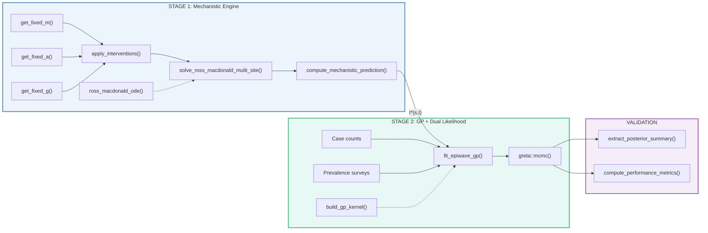

# Code Architecture: `epiwave-foi-model.R`

15 functions — modular, two-stage pipeline with GP residuals and dual likelihood

<strong>Stage 1</strong>: 7 functions 
<code>deSolve</code> + <code>approxfun()</code>

<strong>Stage 2</strong>: 4 functions 
<code>greta</code> + <code>greta.gp</code> / TensorFlow HMC

<strong>Validation</strong>: 4 functions 
Sim-estimation + metrics

`simulate_and_estimate()` orchestrates the full pipeline: data generation, model comparison (GP+offset vs I\*=0 standard geostatistical), and diagnostic plots

<!--
This is the full architecture of our R implementation — 15 functions total.

Stage 1 has 7 functions. Three parameter generators — get_fixed_m, get_fixed_a, get_fixed_g — each produce time-by-site matrices from Vector Atlas data or temperature-dependent defaults. apply_interventions adjusts m, a, g for ITN/IRS. solve_ross_macdonald_multi_site solves the ODE per site. compute_mechanistic_prediction computes I* = m*a*b*z (infection incidence rate, no population).

Stage 2 has 5 functions. build_gp_kernel constructs the spatial Matern 5/2 kernel. ar1 applies AR(1) temporal correlation (ported from epiwave.mapping). simulate_gp_residuals and simulate_prevalence_surveys generate synthetic data. fit_epiwave_gp builds the GP model with dual Poisson plus Binomial likelihood. Population enters the Poisson likelihood, not I*.

The validation layer has simulate_and_estimate as the orchestrator, plus extract_posterior_summary and compute_performance_metrics.
-->
