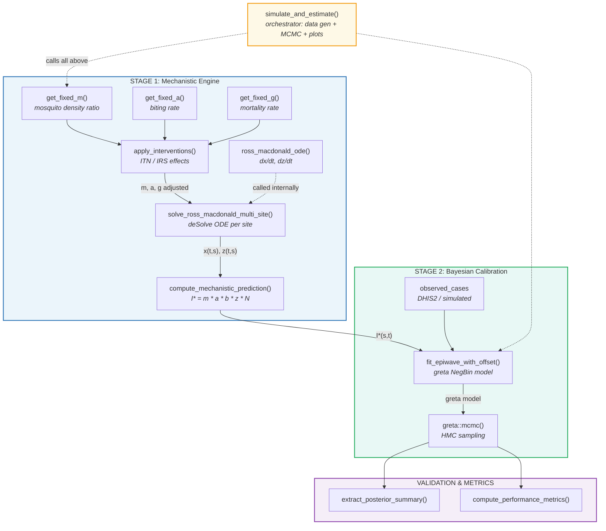

# Code Architecture: `epiwave-foi-model.R`

11 functions in ~580 lines — modular, two-stage pipeline

<strong>Stage 1</strong>: 6 functions 
<code>deSolve</code> + <code>approxfun()</code>

<strong>Stage 2</strong>: 1 function 
<code>greta</code> / TensorFlow HMC

<strong>Validation</strong>: 4 functions 
Sim-estimation + metrics

<!--
This is the full architecture of our R implementation. The code is 580 lines total — deliberately compact.

Stage 1 has 6 functions. Three parameter generators — get_fixed_m, get_fixed_a, get_fixed_g — each produce time-by-site matrices from either Vector Atlas data or temperature-dependent defaults. These feed into apply_interventions, which adjusts m, a, and g based on ITN and IRS coverage using the Griffin 2010 framework. The adjusted parameters then go to solve_ross_macdonald_multi_site, which calls ross_macdonald_ode internally via deSolve for each site. Finally, compute_mechanistic_prediction combines the ODE output with population data to produce I-star.

Stage 2 has just one core function — fit_epiwave_with_offset — which builds a greta model with the Negative Binomial likelihood and the mechanistic offset. It returns a model object ready for HMC sampling.

The validation layer has simulate_and_estimate as the orchestrator — it generates synthetic data, runs both WITH and WITHOUT models, and produces all 5 diagnostic plots. Plus two helper functions for posterior summaries and performance metrics.

The key design principle is modularity — each function has a single responsibility, and the stages are completely decoupled. You can swap in real Vector Atlas data for Stage 1 without touching Stage 2.
-->
