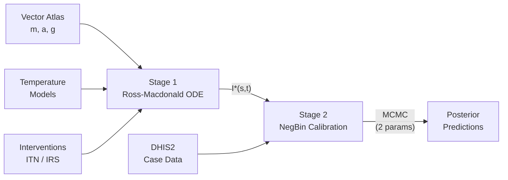

# Why This Framework Wins

### Computational Efficiency
- No MCMC over ODE parameters
- One-time forward ODE solve per site
- Only **2 parameters** for HMC
- **17x speedup** vs joint inference

### Biological Realism
- Fixed Vector Atlas parameters
- Ross-Macdonald dynamics
- ITN/IRS intervention effects
- Seasonal vector abundance

### Statistical Flexibility
- Mechanistic structural prior
- NegBin residual overdispersion
- Data overrides where needed
- Bayesian uncertainty quantification

### Operational Feasibility
- Scales to national mapping
- Modular independent updates
- Interpretable bio parameters
- Counterfactual scenarios

<!--
This summarises the four key advantages of the framework. First, computational efficiency — by fixing entomological parameters and solving ODEs once, we reduce the MCMC problem from 20+ parameters to just 2. Second, biological realism — we're using real entomological data and mechanistic transmission dynamics, not just statistical surfaces. Third, statistical flexibility — the Negative Binomial allows the data to override mechanistic predictions where they're wrong. Fourth, operational feasibility — the modular design means you can update vector data independently from case data, and the framework scales to national mapping.

The diagram at the bottom shows the full data flow — Vector Atlas, temperature models, and intervention data feed into Stage 1, which produces the mechanistic prediction I-star. This flows into Stage 2 along with DHIS2 case data, and MCMC inference on just 2 parameters produces posterior predictions.
-->
