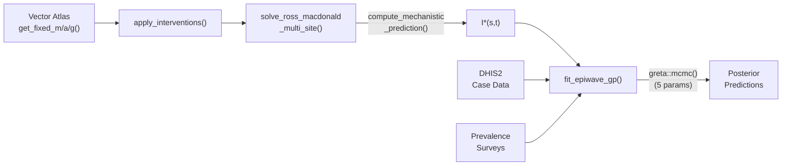

# Why This Framework Wins

### Computational Efficiency
- No MCMC over ODE parameters
- One-time forward ODE solve per site
- Only **5 parameters** for HMC
- Sparse GP with inducing points

### Biological Realism
- Fixed Vector Atlas parameters
- Ross-Macdonald dynamics
- ITN/IRS intervention effects
- Seasonal vector abundance

### Statistical Flexibility
- GP captures spatial residuals
- Dual likelihood (cases + prevalence)
- Data overrides mechanistic model where needed
- Bayesian uncertainty quantification

### Operational Feasibility
- Scales to national mapping
- Modular independent updates
- Interpretable bio parameters
- Counterfactual scenarios

<!--
This summarises the four key advantages of the framework. First, computational efficiency — by fixing entomological parameters and solving ODEs once, we avoid MCMC over ODE parameters entirely. The sparse GP with inducing points keeps Stage 2 tractable. Second, biological realism — we're using real entomological data and mechanistic transmission dynamics, not just statistical surfaces. Third, statistical flexibility — the GP captures spatially-correlated departures from the mechanistic prediction, and the dual likelihood makes all parameters identifiable. Fourth, operational feasibility — the modular design means you can update vector data independently from case data, and the framework scales to national mapping.

The diagram shows the full data flow — Vector Atlas and intervention data feed into Stage 1, producing I-star. This flows into Stage 2 along with DHIS2 case data and prevalence surveys, and MCMC inference on 5 parameters produces posterior predictions with spatial uncertainty.
-->
